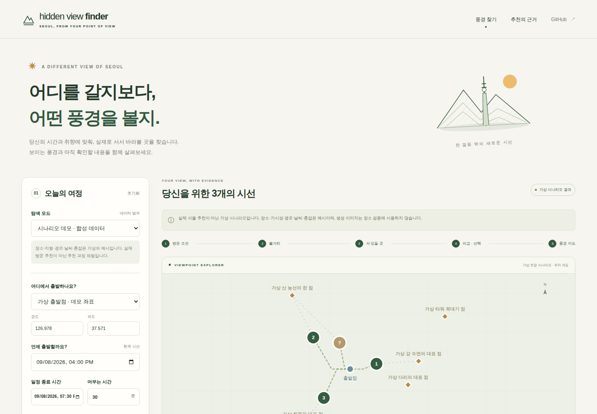
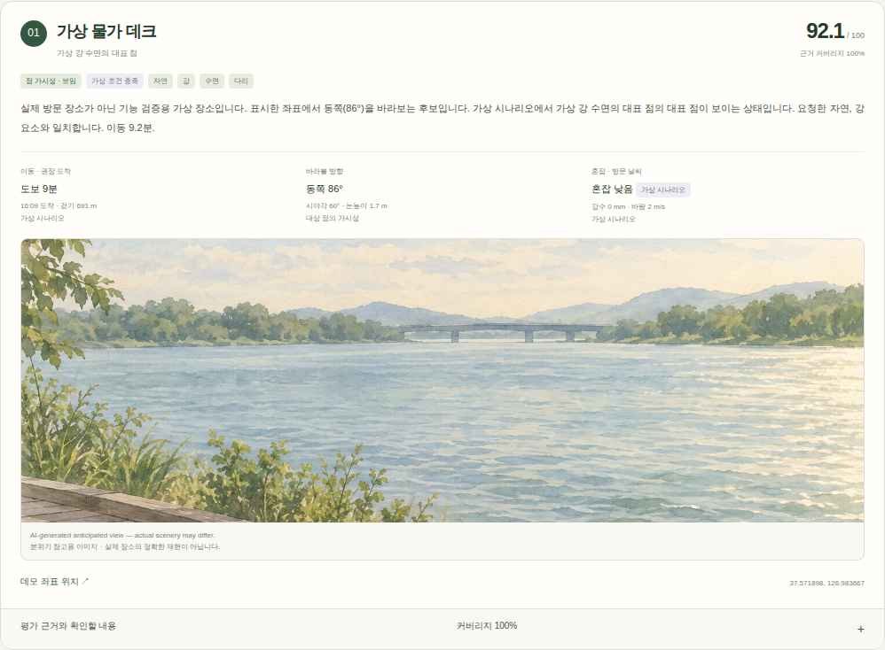

# Hidden View Finder

**내 조건에 맞는 풍경을, 실제로 서서 볼 수 있는 위치에서.**

방문 시간·풍경 취향·혼잡 선호·이동 및 접근성 조건을 입력하면, 랜드마크와 관측 위치를 구분해 평가하는 추천 데모입니다. **사용자 조건 → 랜드마크 → 관측 위치·근거 → Top K → 설명·예상 이미지** 순서를 따릅니다.

[데모 실행·API](docs/demo.md) · [실제 장소·경로 출처](docs/demo-sources.md) · [가시성 엔진](docs/engine.md) · [지형·건물 데이터](docs/data-sources.md)

## 바로 실행

**Python 3.11+로 가상 시나리오 데모를 실행합니다.** Linux의 시간대 DB가 있는 환경에서는 패키지 설치·GIS 데이터·API 키가 필요하지 않습니다.

```bash
git clone https://github.com/myjju08/Hidden_View_Finder.git
cd Hidden_View_Finder
python3 scripts/demo/run.py
```

브라우저에서 **http://127.0.0.1:8000** 을 엽니다. 조건을 바꾸고 추천 카드·비교표·지도상 관계·근거 상세·JSON 내보내기를 확인할 수 있습니다.

Windows 등 IANA 시간대 DB가 없는 환경은 먼저 `python -m pip install tzdata`를 실행하세요. 검증 환경은 Linux/Python 3.12입니다.



<details>
<summary>추천 카드와 AI 분위기 참고 이미지 보기</summary>



</details>

## 두 가지 데모 모드

| 모드 | 실행하는 것 | 결과의 의미 |
| --- | --- | --- |
| **가상 시나리오** | 결정적인 가상 장소·동선·가시성·기상 fixture로 조건 필터, 점수 계산, Top K 다양화, 설명·이미지 흐름 검증 | 실제 서울 여행 추천이 아닙니다. 기본 시각은 고정된 2026-09-08 시나리오입니다 |
| **서울 실제 자료** | 기존 5 m 지형·건물 표면으로 N서울타워의 대표 상단 점을 계산하고, 남산 주변 OSM 보행 노드·경로와 교차 | 실제 자료에 기반한 **근사 후보 탐색**입니다. 이동·개방·접근성 미확인 후보는 확정 Top K와 분리합니다 |

추천에 필요한 필수 조건이 확인되지 않으면 수를 채우려고 임의의 장소를 넣지 않습니다. 현재 실제 서울 자료에서는 전체 경로 접근성과 개방 시간을 확인하지 못해 **확정 추천은 없고 확인 필요 후보를 반환**합니다. UI에서 그 이유와 가시성 상태를 볼 수 있습니다.

## 구현한 추천 규칙

- 이동 시간·보행 거리·방문 가능 시간·체류 시간·휠체어·유모차·계단·경사 제한을 먼저 검사합니다. `visible / blocked / excluded / unknown`을 유지합니다.
- 풍경 30%, 가시성·구도 25%, 시간·기상 20%, 이동 15%, 혼잡 10%의 가중 합을 계산합니다. **미확인 항목은 중간 점수로 채우지 않고**, 알려진 가중치를 재정규화해 점수와 **근거 비중**을 함께 표시합니다.
- 인접 위치이면서 목표·시선 방향·구도가 유사한 후보를 묶어 다양한 Top K를 고릅니다. 점수는 만족 확률이 아닌 비교용 휴리스틱입니다.
- 기상·혼잡의 관측·예보·추정·미확인 및 기준 시점을 구분합니다. 주거 인구로 방문 시점의 혼잡을 추정하지 않습니다.
- 태양 위치는 날짜·시각·좌표에 따른 근사 계산입니다. 실제 일몰 색, 빛 가림, 야간 조명은 보장하지 않습니다.
- 순위를 확정한 뒤 설명과 이미지 프롬프트를 만듭니다. 기본 가상 Top 3의 **AI 분위기 참고 이미지 3장**을 포함하며, 다른 입력에는 `not_generated` 상태와 프롬프트를 반환합니다. 실행 중 이미지 생성 서비스는 연결하지 않았습니다.

모든 생성 이미지의 표기: **“AI-generated anticipated view — actual scenery may differ.”** 이미지는 실제 장소 확인이나 재순위 계산에 사용하지 않습니다. [원본 생성 프롬프트](docs/image-prompts.md)를 보존합니다.

## 실제 사용 데이터

**원본·가공 GIS 데이터는 Git에 포함하지 않습니다.** 취득·준비 스크립트와 출처, 집계 검증 결과를 제공합니다. 작은 가상 fixture와 데모 UI 이미지는 코드·화면 자산입니다.

| 자료 | 실제 사용 범위·시점 | 주의점 |
| --- | --- | --- |
| [서울시 / NGII 등고선·표고점](https://data.seoul.go.kr/dataList/OA-22241/F/1/datasetView.do) | 2023년 등고선 8,570개·표고점 45,870개, EPSG:5174 → 5186 | 표본 TIN 보간한 5 m DTM. 격자 간격이 지형 정확도를 뜻하지 않음 |
| [GlobalBuildingAtlas](https://github.com/zhu-xlab/GlobalBuildingAtlas) | 2025 공개본, 높이 영상 주로 2019/일부 2018, 준비 격자 건물 62,482개 | `height_m`는 **AGL 추정 높이**. 출처별 ODbL / CC BY-NC 4.0 조건 |
| [OpenStreetMap](https://www.openstreetmap.org/copyright) 보행 경로 | 남산·명동 약 3 km 범위, 13,982노드·15,255구간 | 2026-09-08 취득했으나 자료 기준일은 5–7월. 현재 개방·공사를 보장하지 않음 |
| [N서울타워 운영사](https://www.nseoultower.co.kr/eng/global/intro2.asp) | 구조물 높이 236.7 m, OSM 기둥 평면 중심 좌표 | DTM + 구조물 높이의 근사 상단 점. 기초 수직 기준 미확인 |
| OSM 서울 경계 | relation 2297418 | 장애물 계산 후 출력 마스크. 출입 허가의 근거가 아님 |

실제 모드 준비:

```bash
# 먼저 docs/visibility-ko.md의 GDAL 설치·서울 지형/건물 준비 절차 실행
.venv/bin/python scripts/demo/acquire_context.py
.venv/bin/python scripts/demo/run.py --online-weather
```

`--online-weather`는 선택 사항입니다. Open-Meteo 예보를 방문 도착 시각에 맞춰 조회하며 서비스 실패·지원 기간 밖·누락 변수는 미확인으로 둡니다. 혼잡·대중교통·자동차·완전한 무장애 경로 제공자는 아직 연결하지 않았습니다.

## 가시성 엔진과 검증

재사용 가능한 `VisibilityEngine`은 한 목표점당 **native GDAL viewshed 한 번**을 실행합니다. 사람 눈높이는 관측점에만 더하고 건물은 장애물로 유지합니다. AGL은 지붕이 아닌 맨땅 위 높이이며, 필요한 입력 누락과 지붕 아래 목표점은 거부합니다.

이전 중앙 서울 **5 km / 5 m** 엔진 벤치마크는 warm uncached 중앙값 **0.544초**, p95 **0.599초**였습니다. **추천 서비스 전체 지연 시간과는 다른 측정**입니다. [환경·실측 보고서](docs/benchmarks.md), [JSON](reports/seoul-real-benchmark/benchmark.json), [CSV](reports/seoul-real-benchmark/runs.csv)를 확인하세요.

```bash
# 전체 회귀 검사: 기존 엔진 개발 환경 필요
.venv/bin/python -m pytest -q

# GIS 데이터 없이 추천 코어·API 검사만 실행
python3 -m pip install pytest==8.4.2 numpy==2.2.6
python3 -m pytest tests/test_recommendation.py tests/test_demo_service.py -q
```

한 점이 보인다고 건물 전체·숲·강·스카이라인 전체가 보이는 것은 아닙니다. 열린 지면이 출입 가능한 장소라는 뜻도 아닙니다. 수목·벽·발코니·공사·대기·전경 구도의 누락을 명시합니다. [데모 검증 기록](docs/demo-validation.md)에서 실제 실행 범위와 남은 제약을 확인하세요.

## 저장소 구성

```text
src/
  hidden_view_finder/   # 요청 모델, 추천 규칙, 경로·기상, 서울 연동, 웹 데모
    static/            # HTML / CSS / JS / 생성 이미지
  seoul_visibility/    # 독립적인 전처리·가시성 엔진
scripts/
  demo/                # 데모 실행과 작은 보행 맥락 취득
  *.py                 # 기존 GIS 취득·준비·검증·벤치마크
examples/              # 엔진 API와 명시적 설정 예제
tests/                 # 엔진·추천·API 회귀 검사
docs/                  # 실행, 데이터, 기하 계약, 검증 설명
reports/               # 검토한 집계 JSON / CSV
data/                 # 로컬 입력·가공·실행 산출물 (Git 제외)
```
